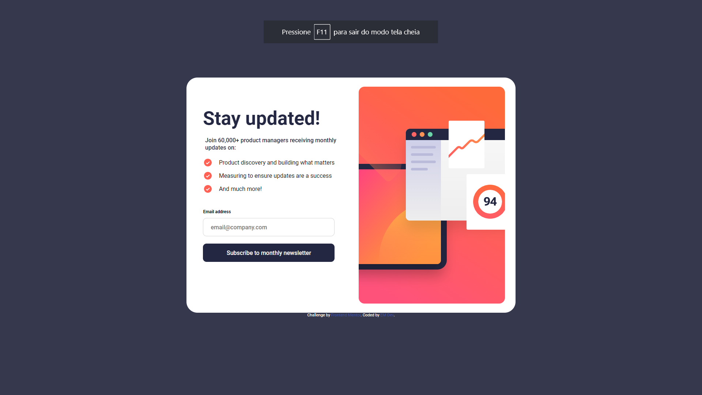

# Frontend Mentor - Newsletter sign-up form with success message solution

This is a solution to the [Newsletter sign-up form with success message challenge on Frontend Mentor](https://www.frontendmentor.io/challenges/newsletter-signup-form-with-success-message-3FC1AZbNrv). Frontend Mentor challenges help you improve your coding skills by building realistic projects.

## The challenge

Users should be able to:

- Add their email and submit the form
- See a success message with their email after successfully submitting the form
- See form validation messages if:
  - The field is left empty
  - The email address is not formatted correctly
- View the optimal layout for the interface depending on their device's screen size
- See hover and focus states for all interactive elements on the page
## Screenshots

## Links
- Solution URL: [Solution](https://www.frontendmentor.io/solutions/newslettersignupwithsuccessmessagemain-zCYxbZqNlL)
- Live Site URL: [Live Site](https://newsletter-sign-up-with-success-message-main-topaz.vercel.app/)
## Built with
- Semantic HTML5 markup
- CSS custom properties
- Flexbox
- CSS Grid
- Mobile-first workflow
## Author

- Website - [Eric Moura](https://emouradev.vercel.app/)
- Frontend Mentor - [@xXAxiomaXx](https://www.frontendmentor.io/profile/xXAxiomaXx)

